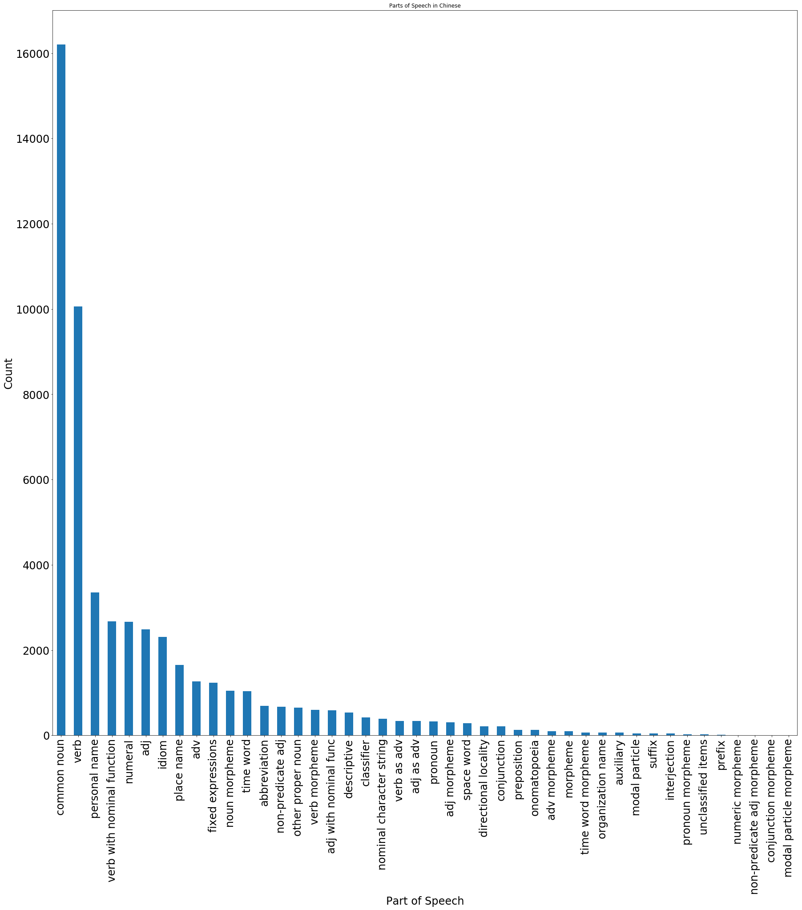

Kyle Landin

ktl14@pitt.edu

12/15/2017

# Final Report

## Table of Contents
- [Introduction and Background](#introduction-and-background)
- [Licensing](#licensing)
- [Reformatting Data](#reformatting-data)
- [Data Collection and Analysis](#data-collection-and-analysis)
- [Conclusion and Future Study](#conclusion-and-future-study)

## Introduction and Background
When I originally started trying to plan a project for this class, I wanted to do something that involved web scraping and language analysis and comparison between news articles written and approved by the Chinese Government and news articles written on the same topic by authors in the United States or other places with free speech or interesting political opinions. Unfortunately, my knowledge of Python was not enough to be able to perform all of that and I instead decided to look at and analyze the Lancaster Corpus of Mandarin Chinese.

## Licensing
Choosing a license for this project was very easy, as the data was distributed through Creative Commons as an [Attribution-NonCommercial-ShareAlike] (https://creativecommons.org/licenses/by-nc-sa/3.0/legalcode). This means that the University of Oxford allows for the noncommercial sharing of their information. The only thing required of me is that the University of Oxford is credited and that any information I happen to have edited or transformed be licensed and available under the same licensing.

## Reformatting Data
My educational background includes four years of college level Mandarin Chinese language learning, as well as being in the process of learning about Linguistics, so being able to work with a corpus in Mandarin was very exciting to me. My initial plan for this corpus was to read all of the XML files and have them output into dataframes that would contain the Chinese characters, the pinyin (Romanization of the Chinese characters), and their parts of speech. This first attempt ended with a lot of work and very little progress due to XML reading in every separate character or letter into its own column in a dataframe. The only way I found to rectify this was to combine all of the columns into a single one and then delete all of the extra columns. When it came to processing the pinyin columns, this sometimes entailed deleting over 20 or 30 columns. This code, as well as some other practice code, can be found in the [Previous_Code](https://github.com/Data-Science-for-Linguists/Study_of_the_LCMC/tree/master/Previous_Code) folder.

After spending so much time while not getting anywhere with actual analysis, I moved onto just working with lists containing the characters, the pinyin, and the part of speech tags. Once each list was created, I zipped the three lists into one so that it displayed like: (Character, Pinyin, POS) when printed. Also, using the set function, I was able to create separate lists of only unique characters, removing any duplicates from the list so only one of each remained.

Using a dictionary, I was also able to replace the Part of Speech tags that were pulled from the XML file with what their actual meaning was. Instead of ‘tg’, the list would output ‘time word morpheme’ making it easier to identify what part of speech each word is. There were several exceptions where a new dictionary had to be created to account for misspelling in the tags in the XML. One such exception was in the [Biography and Essay Data]() section where a noun morpheme tag was labeled as ‘nr ‘ instead of just ‘nr’ in the XML file. This put forth an error that I corrected by adding ‘nr ‘ as another part of the dictionary.

Once all of the categories had their own lists, I ultimately compiled all of them into a single list for a full set of the data. This ended up having 839,006 words, showing the total of the Lancaster Corpus of Mandarin Chinese. After creating this, I used the set function again to find the number of unique words in the corpus which ended up being 53,376 unique words. Using this list of unique words, I finally was able to create a dataframe for use in some data collection.

## Data Collection and Analysis
All code and data referenced can be found in the [Data Collection](https://github.com/Data-Science-for-Linguists/Study_of_the_LCMC/blob/master/LCMC_Compiled_Data.md#data-collection) section of my project.

At first, I was not really sure what kind of data I could pull out of this corpus since my initial thoughts were only about reformatting the corpus out of an XML format into something that might be more accessible. After creating the compiled data, I simply decided to investigate some things that interested me about the Chinese language. The first thing I did was use the dataframe of unique words to create a bar graph showing the distribution of all the words in the corpus based on their Part of Speech category.

The outcome of this bar graph was relatively expected, with the bulk of the corpus being made up of common nouns followed by verbs. What surprised me the most was how quickly the numbers dropped after those first two categories. The next largest category, personal names, has less than half the number of verbs and all the following categories continue to grow smaller and smaller very quickly.

Utilizing the fully combined list of data and not just the unique words, something else that I wanted to find out was what the most common words in the corpus were. The results were unsurprising, with the top 20 most common words being heavily composed of auxiliaries, common verbs and adjectives, as well as pronouns. The most common word in the Lancaster Corpus of Mandarin Chinese is ‘的’ which is an auxiliary very common for denoting possession and appeared 50,832 times.

This appearance of ‘的’ so frequently made me question whether many words existed in the corpus with ‘的’ being the word final or the word initial. Within the corpus, there are 46 unique words that have ‘的’ as the word final and 17 unique words that have ‘的’ as the word initial (this search included ‘的’ itself as being a word initial though).

After this search, I decided to look at different parts of speech that I found to be interesting. The three that I chose to look at were: onomatopoeia, idioms, and common nouns.

Onomatopoeia in Chinese was always interesting to me mainly because the characters themselves tend to be nonsensical and only use the way they are pronounced to convey meaning. In this corpus, there are 365 examples of onomatopoeia with ‘哈哈’ being the most common with 19 occurrences. The pinyin for this is ‘ha1ha1’ and is used to convey laughter through writing similarly to how we use ‘haha’ in English.

Idioms are also very interesting. In Chinese, most, if not all idioms take the form of a four word phrase. Similarly to onomatopoeia, many times the characters that go together to form an idiom don’t necessarily make sense without the overall meaning. The most common idiom in this corpus occurred 25 times and was ‘艰苦奋斗’ which means ‘hard struggle’. Individually, the characters mean ‘difficult’, ‘bitter’, ‘exert oneself’, and ‘fight’ respectively. With each of these characters, the meaning is actually quite easy to grasp, but there are many that are not as straightforward as this idiom.

In terms of nouns, as we saw earlier, the corpus is largely composed of them. With just over 16,000 unique nouns, I found that in total, there are 180,211 nouns total in the corpus. This makes up just over 21% of the corpus. The most common nouns were also relatively predictable, being things such as ‘人’, ‘问题’, and ‘经济’. These mean: ‘person’, ‘question/problem/issue’, and ‘economy’ in that order. With much of the data coming from news articles and similar sources, these three nouns seem to be very in place.

My next topic of investigation was on some common formal vs informal characters. Having prior knowledge of Chinese, the character ‘您’ (nin3) is the formal version of ‘你’ (ni3) that is not normally used in written form. Both of these characters mean ‘you’, but the first one is much more formal due to the heart radical on the bottom of the character. ‘你’ ended up having 2900 occurrences in the corpus while ‘您’ only had 214. This proved my initial hypothesis right for this topic that ‘您’ was mainly used in speech and not in writing, though I attribute the number of appearances that it does have to much of the data being comprised of literature and fiction.

The next set of characters I looked at were in relation to family. The informal version of ‘wife’ is ‘老婆’ and the formal version is ‘太太’. The informal version appeared 51 times while the formal version appeared 41 times.

I also looked at the formal and informal versions of ‘parents’. For the informal search, I used a combined search on ‘爸妈’ and ‘爸爸妈妈’ since they both mean the same thing and the latter is just a reduplication of the former. For the formal version, I used ‘父母’. In the end, the informal term showed up zero times while the formal version showed up 187 times.

The final piece of data that I wanted to look at was on pronouns. My search of the whole corpus resulted in 49,714 results for the use of pronouns with 352 being unique. What I really wanted to look at though was the usage of ‘他’, ‘她’, and ‘它’ (all pronounced ta1). These, when spoken, are all the same, but when written, they mean ‘he’, ‘she’, and ‘it’ respectively. Looking at the numbers, men were twice as often referred to as women, with the male version ‘他’ appearing 5898 times and the female version ‘她’ only appearing 2825 times. The gender neutral ‘它’ only appeared 1077 times. Perhaps someone could use this data to talk about the disparity in reference to men and women, with men being referred to twice as often as women in Chinese news and literature.

## Conclusion and Future Study
Working on this project really helped me understand how much effort was put into creating and compiling this corpus. All I really did was try and make it easier to read and access. I think some of the data that I acquired such as the pronoun usage could be studied further, possibly only focusing on the news data instead of everything else. I would also like to find more words to search that have counterparts that are mainly only used in spoken language instead of written language and see if they show up anywhere in the corpus. Overall, I feel like I accomplished what I set out to do with this corpus and have made some interesting finds despite only scratching the surface of what this corpus has to offer.
